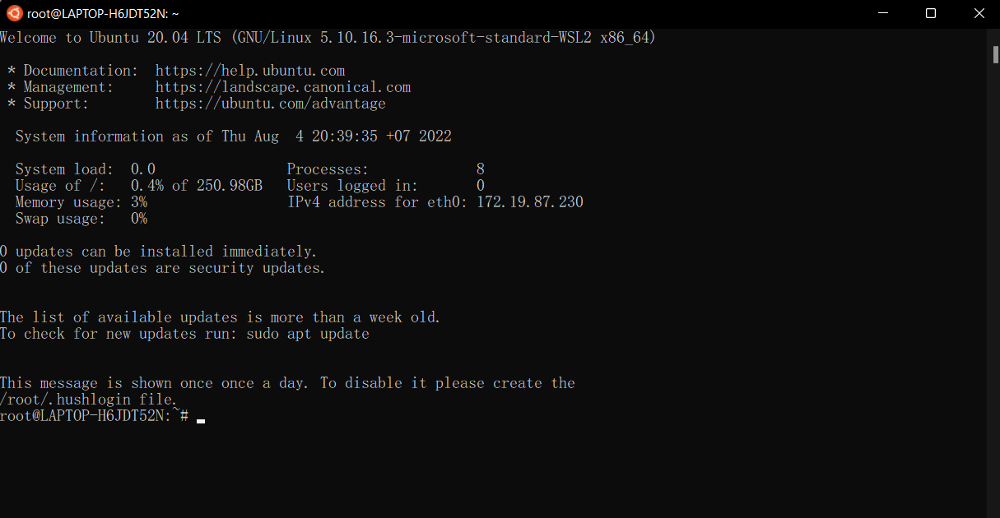

<h2 style="color:#F7E684"> <b> INSTALL UBUNTU ⬇ </b> </h2>

---

[Back Home]

[Back Home]: https://spcyr.github.io/

### I've tried install Ubuntu. How I installed?

-__Install WSL__
  >(Windows11) Open a command prompt with administrator privileges and run this command then reboot your machine when prompted:

  >Aleady!
 

-__Download Ubuntu Dextop__ from [Get Ubuntu]

[Get Ubuntu]: https://ubuntu.com/download

  

