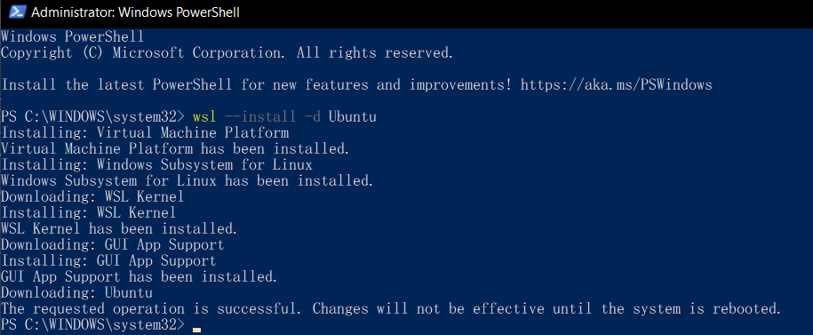
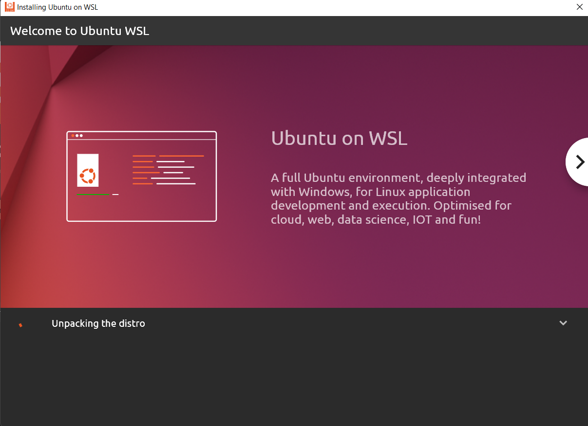
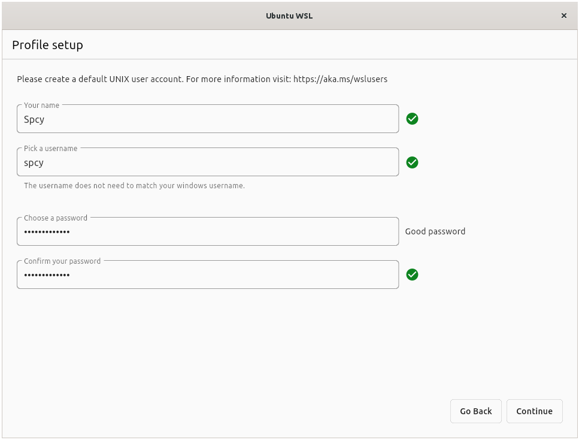
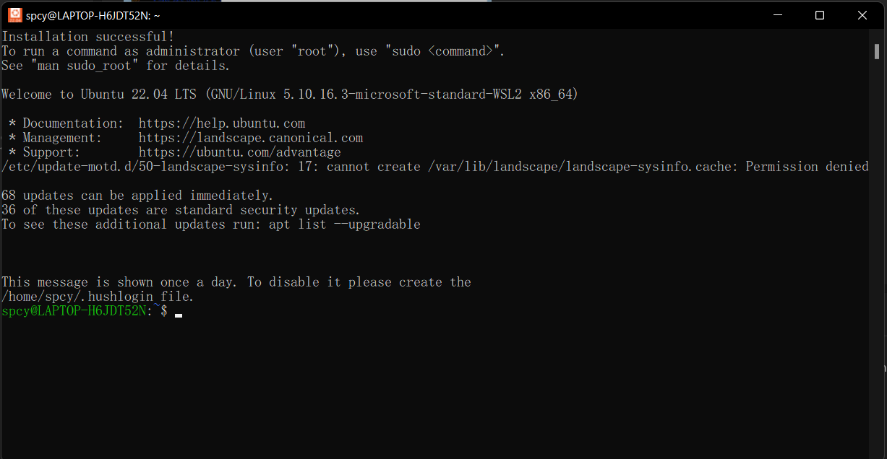
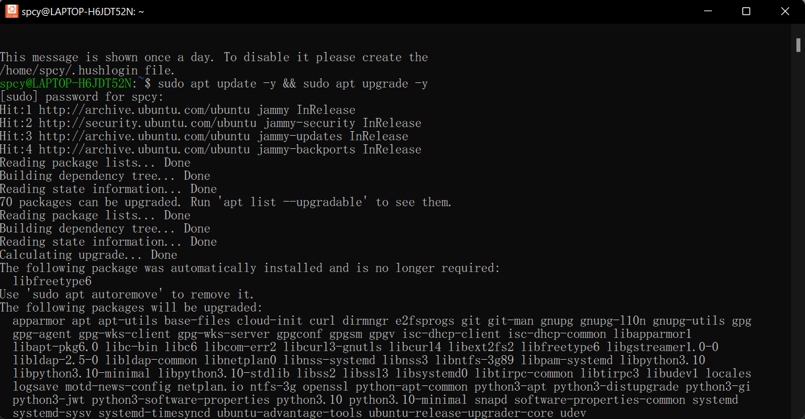

<h2 style="color:#F7E684"> <b> INSTALL UBUNTU ⬇ </b> </h2>

---

[<<Back Home]

[<<Back Home]: https://spcyr.github.io/

<p style="font-family: cursive;"> <b> I've tried install Ubuntu. How I installed? </b> </p>


-__Install WSL__
  >Open a command prompt with administrator privileges and run this command then reboot your machine when prompted:


  >Aleady!
 



-__Download Ubuntu 22.04 LTS__ from Microsoft Store

 
  

  

  

  
  
### __Try To Run Linux Commands__
  
>Check update and upgrade
  
```
sudo apt update -y && sudo apt upgrade -y
```



  
  
---  
  
  
#### reference 
[tutorials]

[tutorials]: https://docs.microsoft.com/en-us/windows/wsl/tutorials/gui-apps
