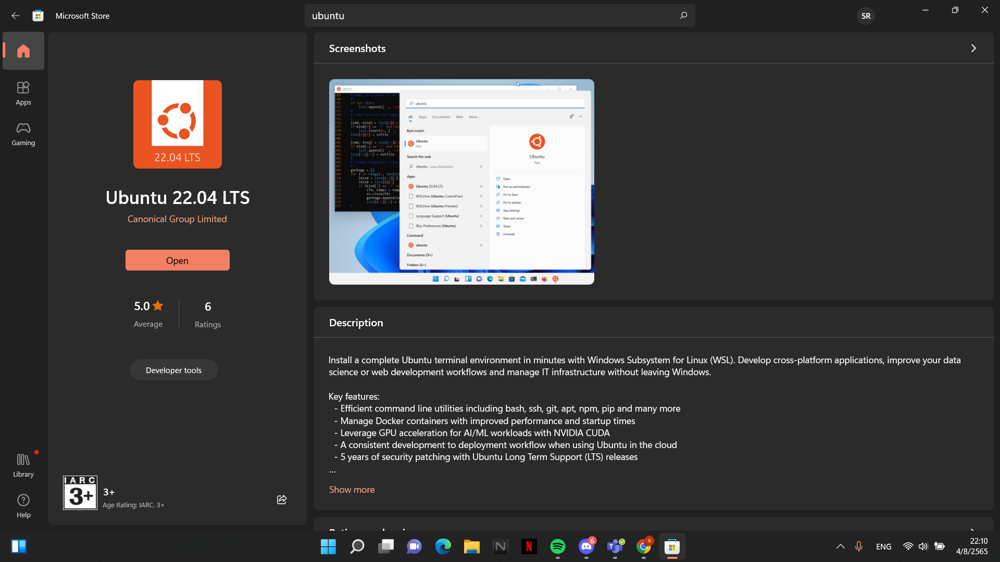
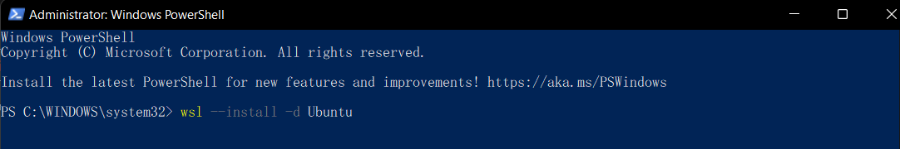

<h2 style="color:#F7E684"> <b> INSTALL UBUNTU ⬇ </b> </h2>

---
-__Download Ubuntu Dextop__ from [Get Ubuntu]

[Get Ubuntu]: https://ubuntu.com/download

-__Install WSL__
  >Open a command prompt with administrator privileges and run this command then reboot your machine when prompted:

