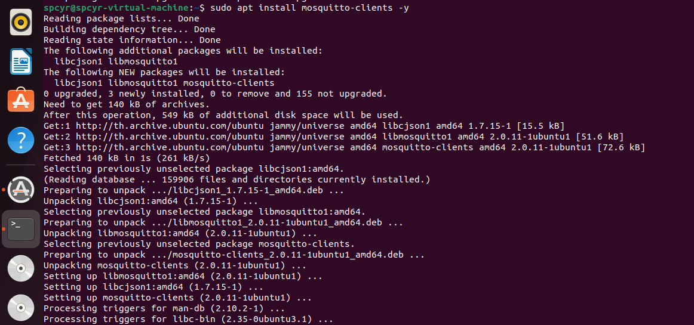

<h2 style="color:#F7E684"> <b> INSTALL MQTT ⬇ </b> </h2>

[<<Back Home]

[<<Back Home]: https://spcyr.github.io/

* __การติดตั้ง Mosquitto Client สำหรับระบบปฏิบัติการ Linux__

```
$ sudo apt update
$ sudo apt install mosquitto-clients -y
```
*นี่คือผลลัพธ์ที่ได้*




[<<Back Home]
