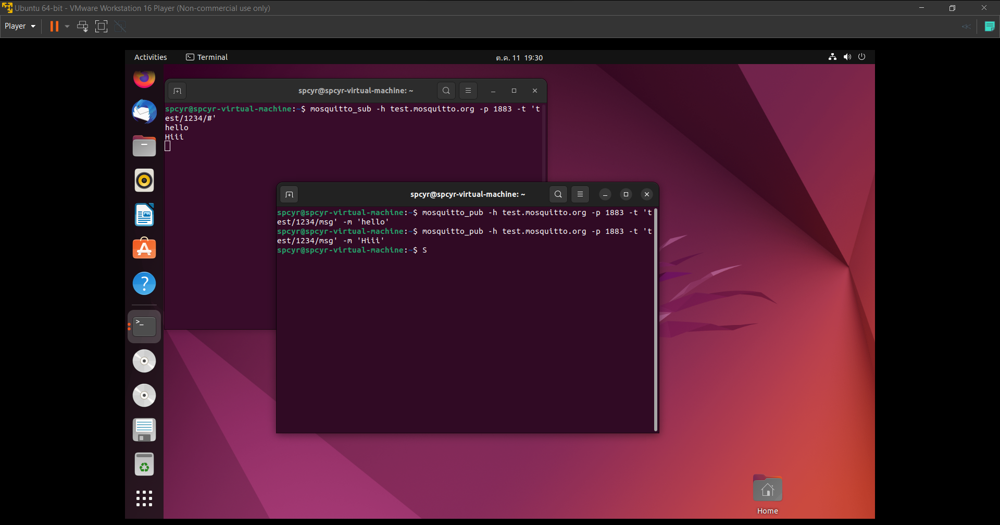

<h2 style="color:#F7E684"> <b> INSTALL MQTT ⬇ </b> </h2>

[<<Back Home]

[<<Back Home]: https://spcyr.github.io/

* __การติดตั้ง Mosquitto Client สำหรับระบบปฏิบัติการ Linux__

```
$ sudo apt update
$ sudo apt install mosquitto-clients -y
```
*นี่คือผลลัพธ์ที่ได้*


*สำหรับการเขียนภาษาซี*
```
$ sudo apt install build-essential libmosquitto-dev -y
```

*สำหรับส่งข้อความในหัวข้อ test/1234/#*
```
$ mosquitto_pub -h test.mosquitto.org -p 1883 -t 'test/1234/msg' -m 'hello'
```

*สำหรับรับข้อความในหัวข้อ test/1234/#*
```
$ mosquitto_sub -h test.mosquitto.org -p 1883 -t 'test/1234/#'
```

*ผลลัพธ์จากการรับและส่งข้อความ*



[<<Back Home]
