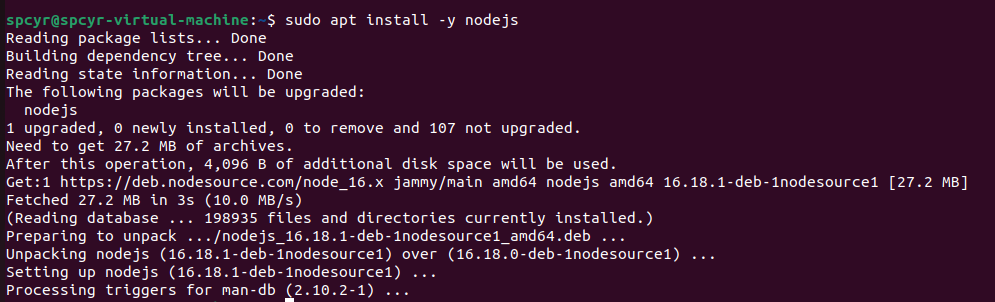
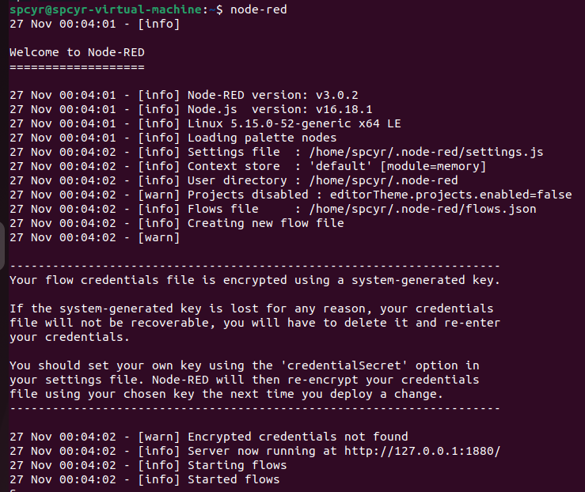
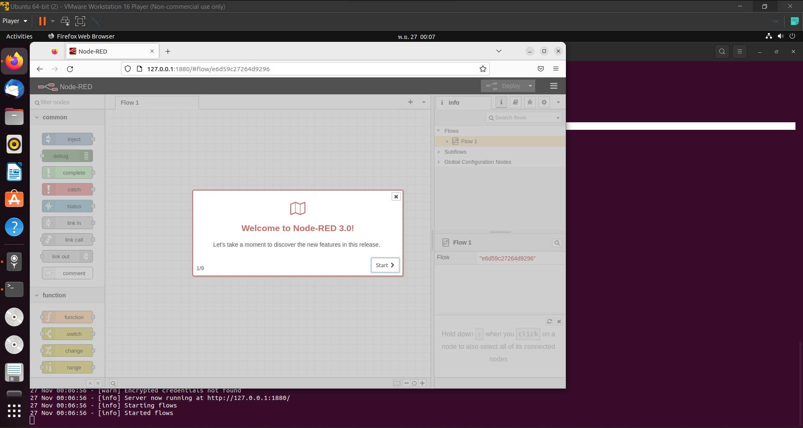

<h2 style="color:#F7E684"> <b> INSTALL NODE-RED ⬇ </b> </h2>

---

[<<Back Home]
 
[<<Back Home]: https://spcyr.github.io/

*Install curl and Node (v16.x)*

```
$ sudo apt install -y curl
$ curl -fsSL https://deb.nodesource.com/setup_16.x | sudo -E bash -
$ sudo apt install -y nodejs
```
 

*Install Node-RED locally*

```
$ sudo npm install -g --unsafe-perm node-red
$ node-red
```
 

*open link : http://127.0.0.1:1880/ *

 

[<<Back Home]
